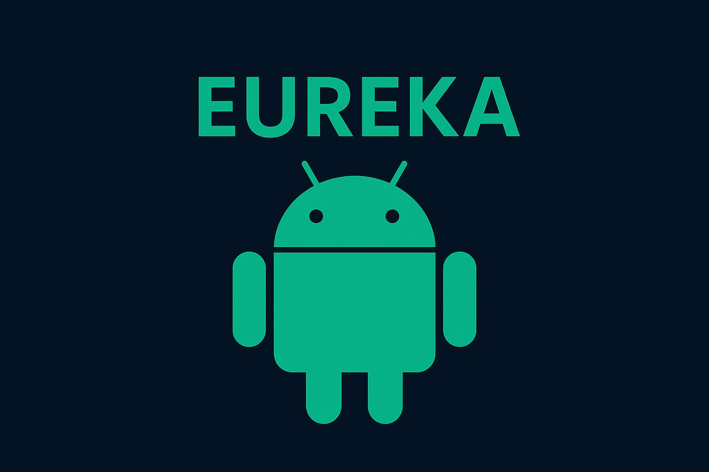

<h1 align="center">
  
</h1>

```C
#include <std_disclaimer.h>

/*
* Your warranty is now void.
*
* I am not responsible for bricked devices, dead SD cards,
* thermonuclear war, or you getting fired because the alarm app failed. Please
* do some research if you have any concerns about doing this to your device
* YOU are choosing to make these modifications, and if
* you point the finger at me for messing up your device, I will laugh at you.
*/
```

## **Disclaimer**
- I am not responsible about any damage of any kind that this kernel may cause.
- You are allowed to use this kernel in your project with proper credits and links to the XDA thread or source code.
- You are allowed to base your projects on my sources by giving proper credits to the original authors.
- Bugs can be reported in XDA or via the community's Telegram Group. Please be more clear as possible and make sure you provide detailed info when reporting bugs.

## **Features**
- Built from G990B2XXUFIYJ1 kernel source code
- Based on tag [LA.UM.9.14.r1-26700-LAHAINA.QSSI16.0](https://git.codelinaro.org/clo/la/kernel/msm-5.4/-/tree/LA.UM.9.14.r1-26700-LAHAINA.QSSI16.0/)
- Upstreamed to Linux v5.4.301
- Pure stock kernel, only minor changes were applied
- Built with Clang 19.0.0 ([r530567](https://android.googlesource.com/platform/prebuilts/clang/host/linux-x86/+/refs/heads/main/clang-r530567/)) Toolchain
- Samsung Knox features disabled (RKP, FIVE, FASTUH, Defex etc.)
- Switchable SELinux status

## **Supported devices**
All the Galaxy S21 FE 5G (Snapdragon) device's variants are supported. This includes:
- SM-G990B (r9q)
- SM-G990B2 (r9q2)

## **How to install?**
1. Download and install a custom recovery ([TWRP](https://xdaforums.com/t/recovery-official-twrp-for-galaxy-s21-fe-5g-snapdragon-with-crypt-support.4677578/));
2. If you do have Magisk installed, please uninstall it via the Magisk Manager app;
3. Download the Eureka Kernel flashable zip in the [releases](https://github.com/saadelasfur/eureka_releases/releases) page, make sure to download the correct version for your device;
4. Reboot to recovery: to do so power off your device, connect it to a computer via an USB cable and hold both volume up and power on buttons;
5. If you desire to restore back your currently installed kernel, make a backup of the following partitions: **Boot, DTBO, Vendor Boot, Vendor Image**;
6. Flash the Eureka Kernel zip you previously downloaded, reboot to system if the install went fine.

## **Source code**
Kernel source code: [https://github.com/saadelasfur/android_kernel_samsung_sm8350](https://github.com/saadelasfur/android_kernel_samsung_sm8350)

## **Credits**
- [Samsung OSRC](https://opensource.samsung.com/) for providing the kernel source code
- [@glikched](https://github.com/retrozenith) for his patches from AQUA kernel
- [@pascua28](https://github.com/pascua28) for his assistance and support
